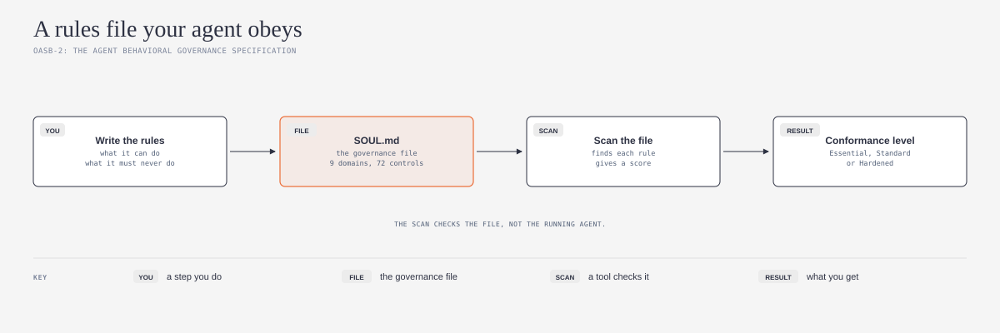
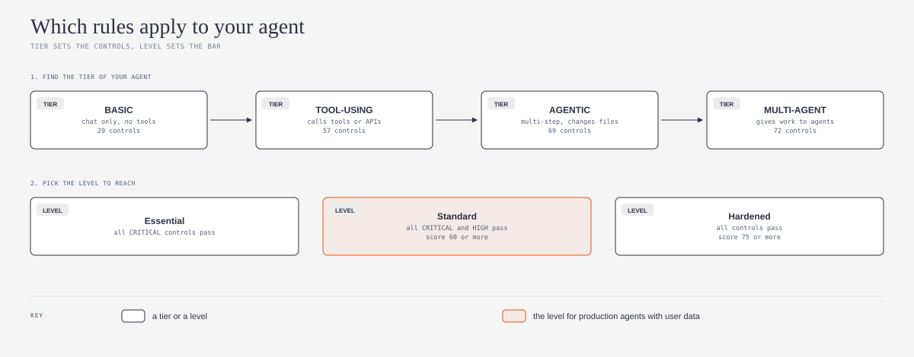

# agent-governance-spec-explained

## What is it?

This repository is a plain-language guide and an agent skill. Both are based on OASB-2, the Agent Behavioral Governance Specification by [OpenA2A](https://github.com/opena2a-standards). OASB-2 tells you how to write the rules of your agent in one file, `SOUL.md`. It also tells you how to measure if the file covers the important behaviors.



*Do you want the technical words in plain English? Refer to the [Jargon Buster](JARGON.md).*

## What problem does it solve?

Most agents get their instructions in a long prompt. Often, nobody writes down what the agent must never do, who it must obey first, or when it must stop and ask a person. Then a user, a web page, or a document can change the behavior of the agent. OASB-2 gives you a clear list of the rules to write down, and a simple way to find the rules that are missing.

## Who is it for?

This guide is for small teams and solo builders who put AI agents into real work. For example, an agent that answers customers, changes code, or uses business tools for your team. You do not need to write code to use the skill. The skill uses the open [Agent Skills](https://agentskills.io) format (`SKILL.md`), so it works with Claude, Codex, GitHub Copilot, and other AI agents that support this format.

## Safe by default

1. **Read and draft first.** The skill reads your agent instructions and writes a draft `SOUL.md`. It does not change your agent before you approve.
2. **No secret keys in the chat.** The skill never asks for a private key, a token, or a password. Do not paste them into the chat.
3. **Honest results.** The skill tells you which rules are missing. It also tells you that a good score shows what the file says, not what the agent does.
4. **Your files stay yours.** The draft goes into your project folder. You can read, change, or delete it at any time.

## What does it do?

Ask your AI agent to check the rules of your agent. The skill helps your AI agent to do these steps:

1. Find the tier of your agent: chat only, tool use, multi-step, or many agents
2. Find the current instructions of your agent, and compare them with the nine domains
3. Make a list of the missing rules, with the CRITICAL and HIGH rules first
4. Write a draft `SOUL.md` from the template for your tier
5. Tell you the conformance level that the draft can reach, and the next steps

The skill also looks for three frequent mistakes. The first mistake is a rules file with no "never" rules. The second mistake is a rules file that the agent itself can change. The third mistake is to think that a good score proves good behavior.

## How does it work?

*The diagrams below use the visual language of [cathrynlavery/diagram-design](https://github.com/cathrynlavery/diagram-design):*


OASB-2 sorts 72 rules, which it calls controls, into nine domains. Each control has a severity: CRITICAL, HIGH, MEDIUM, or LOW. Two controls are CRITICAL. The first control is a set of safety rules that nobody can override. The second control tells the agent to refuse requests to pretend that it has no rules.



The tier of your agent decides how many controls apply. An agent that only chats needs fewer rules than an agent that changes files or gives work to other agents. The conformance level decides how many controls must pass. Essential needs all CRITICAL controls. Standard also needs all HIGH controls and a score of 60 or more. The source says that Standard is the correct level for production agents that handle user data or do actions with large effects.

**My note (not from the source):** other agent tools also use a file with the name `SOUL.md`. For example, [Waku](https://github.com/ShenSeanChen/waku-agent) keeps its personality and its learned rules in `SOUL.md`, and the agent can add rules to that file during a chat. If an agent can change its own rules file, a user or a web page can change the rules of the agent. Keep your rules file in version control, review each change, and do not let the agent edit it.

## How to install

First, make a folder with the name `agent-behavior-rules`. Put `SKILL.md` from this repository in that folder. Then do the steps for your AI agent.

### One command for all agents

If you have Node.js, run this command in a terminal. The command installs the skill for Claude Code, Codex, GitHub Copilot, and other agents.

```
npx skills add ams-builds/agent-governance-spec-explained
```

To get the latest version later, run `npx skills update`. The command uses [skills](https://github.com/vercel-labs/skills) by [Vercel](https://github.com/vercel-labs). If you do not use a terminal, use the instructions for your agent below.

### Claude

1. In claude.ai or the Claude desktop app, make a zip file of the `agent-behavior-rules` folder.
2. Upload the zip file in **Settings > Capabilities > Skills**.
3. In Claude Code, put the folder in `~/.claude/skills/agent-behavior-rules/`.

### Codex

1. Put the folder in `~/.agents/skills/agent-behavior-rules/` for all your projects.
2. Or, put the folder in `.agents/skills/agent-behavior-rules/` in one project.
3. Or, tell Codex to use `$skill-installer` with the GitHub URL of this repository.
4. If the skill does not show, start Codex again. Source: [Codex skills documentation](https://learn.chatgpt.com/docs/build-skills).

### GitHub Copilot

1. Put the folder in `~/.copilot/skills/agent-behavior-rules/` for all your projects.
2. Or, put the folder in `.github/skills/agent-behavior-rules/` in one repository.
3. Use Copilot in agent mode. Source: [GitHub Copilot skills documentation](https://docs.github.com/en/copilot/how-tos/copilot-cli/customize-copilot/create-skills).

These three agents are the most used AI coding agents in the [JetBrains 2026 survey](https://blog.jetbrains.com/research/2026/08/ai-coding-agent-adoption-2026/). Other agents that support Agent Skills use the same `SKILL.md` file. Refer to the documentation of your agent for the folder.

## How to use it

After you install the skill, speak to your AI agent in your usual words:

- "Check the governance rules of my agent"
- "Write a SOUL.md for my agent"
- "Which OASB-2 rules is my agent missing?"

The skill starts automatically. You do not need to use its name.

## Credit and license

This guide is based on [OASB-2: Agent Behavioral Governance Specification](https://github.com/opena2a-standards/agent-governance-spec) by [OpenA2A](https://github.com/opena2a-standards) ([opena2a.org](https://opena2a.org)). This guide explains the source at commit `8c279f0` (7 October 2026), specification version 1.0. That project uses the Apache License 2.0. This repository uses the same license. Refer to [LICENSE](LICENSE) and [NOTICE](NOTICE).

This is an independent plain-language guide. It is not an official part of the source project. For the full rules, use the source specification.

Changes from the source:

1. I wrote the main concepts again in Simplified Technical English, for readers who are not specialists.
2. I made three new diagrams.
3. I wrote an agent skill that applies the specification to one agent.
4. I did not copy the specification, the control definitions, or the templates. The skill refers to them by their file paths in the source repository.

**Language.** I wrote the text in Simplified Technical English (ASD-STE100). The idea to ask an AI model to write in ASD-STE100 comes from [Andrej Karpathy](https://github.com/karpathy) ([his post on X](https://x.com/karpathy/status/2105819303471976479)). I used the [simplified-technical-english](https://github.com/0xpili/simplified-technical-english) agent skill by [pili](https://github.com/0xpili) to write and check the text. ASD-STE100 is a specification of ASD (AeroSpace and Defence Industries Association of Europe). This repository is not related to ASD.

---

*New words? The [Jargon Buster](JARGON.md) gives plain-English explanations of governance file, control, domain, tier, conformance level, safety immutable, and more.*
